#code genius

##简介
code genius是一个代码生成器，用来生成各种程序代码。目前只支持java，主要是为java web应用程序生成通用代码，然后再根据具需求自己修改。

##使用说明
先看看效果，其他的后面说

需求:编写一个简单的图书信息管理程序
>1. 打开MySQL命令行，新建一个数据库，例如 book_db
>2. 打开eclipse新建一个web项目 book_demo，*Dynamic web module version选择2.5*（重要），设置资源编码为UTF-8（否则会有乱码）
>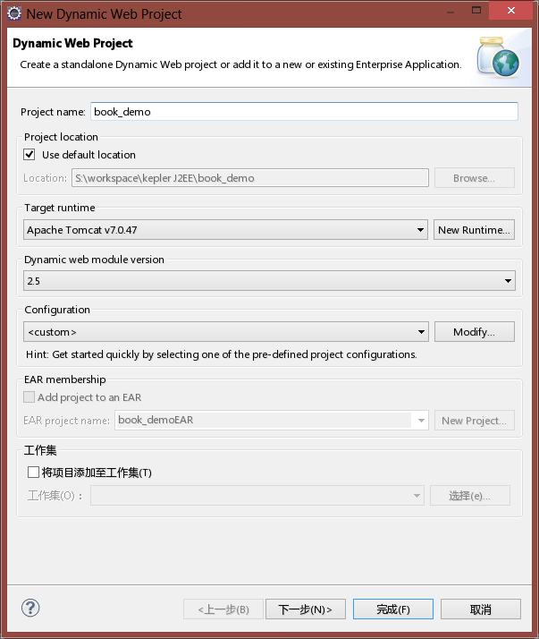
>3. 由于暂时还没上传到maven中央库,手动将[codegenius-1.0.0.nodep.jar](https://github.com/fishlab/codegenius/blob/master/genius/prebuild/codegenius-1.0.0.nodep.jar?raw=true) 添加至项目构件路径，给项目添加maven支持(解决其他依赖)
>4. 新建两个源文件夹config和test分别用来放配置文件和测试用例，code genius默认是这两个文件夹，可以修改
>5. 编写代码

>* 在源文件夹下新建一个Book类
```java
package org.fishlab.book_demo.data;
public class Book {
	private int id;
	private String name;
	private String author;
	private String description;
	private float price;
	public int getId() {
		return id;
	}
	public void setId(int id) {
		this.id = id;
	}
	public String getName() {
		return name;
	}
	public void setName(String name) {
		this.name = name;
	}
	public String getAuthor() {
		return author;
	}
	public void setAuthor(String author) {
		this.author = author;
	}
	public String getDescription() {
		return description;
	}
	public void setDescription(String description) {
		this.description = description;
	}
	public float getPrice() {
		return price;
	}
	public void setPrice(float price) {
		this.price = price;
	}
}
```

>* 暂时还没时间写eclipse插件，就用Java写一个启动器吧
```java
package test.generate;
import org.fishlab.codegenius.CodeGenius;
import org.fishlab.codegenius.CodeGeniusConfiguration;
import org.fishlab.codegenius.CodeGeniusException;
import org.fishlab.codegenius.GenerationContext;
import org.fishlab.codegenius.Project;
import org.fishlab.codegenius.datasource.MySQL5DataSource;
import org.junit.Test;
public class Luncher {
    @Test
    public void test() throws CodeGeniusException{
        Project project=new Project("org.fishlab.book_demo");
        project.setDataSource(new MySQL5DataSource("jdbc:mysql://localhost:3306/book_db","root","123456"));
        project.setVersion("1.0.0-demo");
        project.setProperty("hibernate.version", "4.1.7.Final");
        project.setProperty("spring.version","3.2.5.RELEASE");
        CodeGenius genius =CodeGeniusConfiguration.defaultGenius();//默认的配置实例
        GenerationContext context= genius.createContext();
        context.scanPackage("org.fishlab.book_demo.data");//扫描这个包下面的所有类
        context.setOutputDistination(".");//输出目录为当前目录
        context.setProject(project);
        genius.process(context);
    }
}
```
>* 执行它,如果最后看到如下字样则成功了
```console
all generation done,have fun.
```

>* 最后生成的的代码如下
>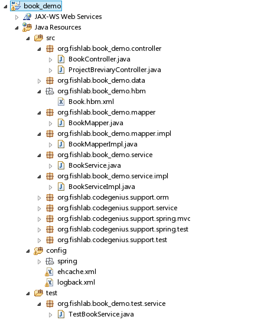

>* 生成的资源文件以及视图
>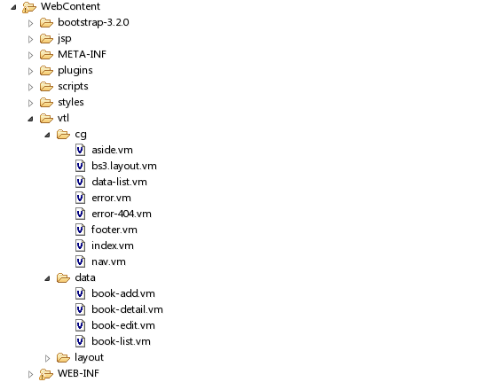

>6. 运行测试
>* 部署至Web服务器并启动
>* 打开浏览器，输入 http://localhost:8080/book_demo/index.html
>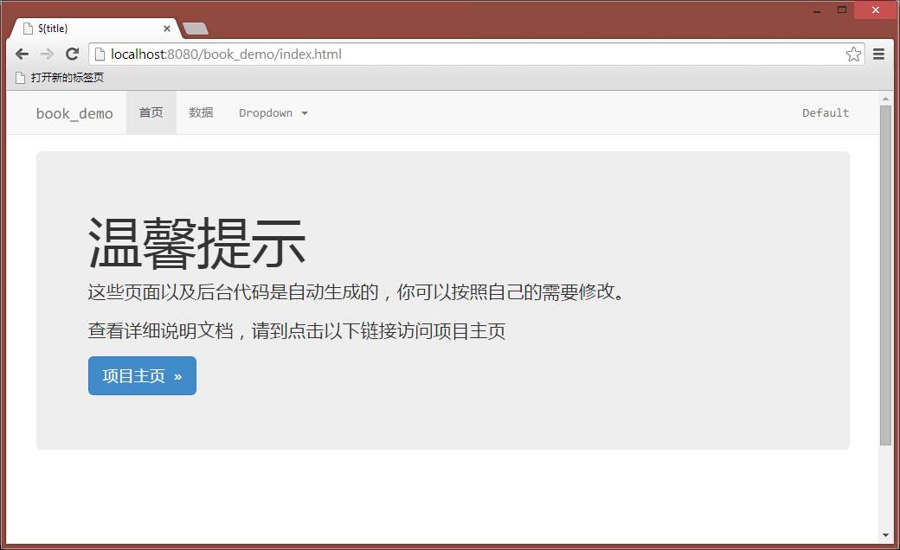
>* 由于我们只写了一个实体类，生成的数据类型只有一个
>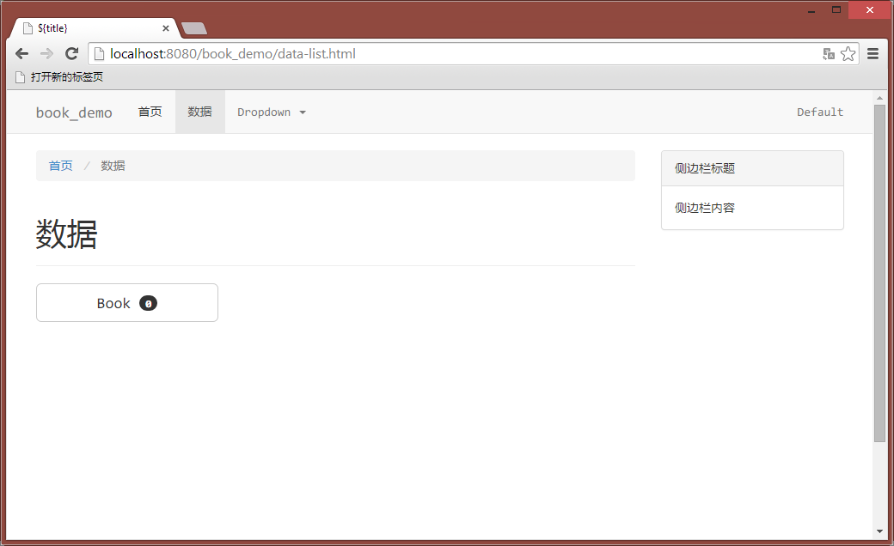
>* 点击 Book,现在没有任何记录
>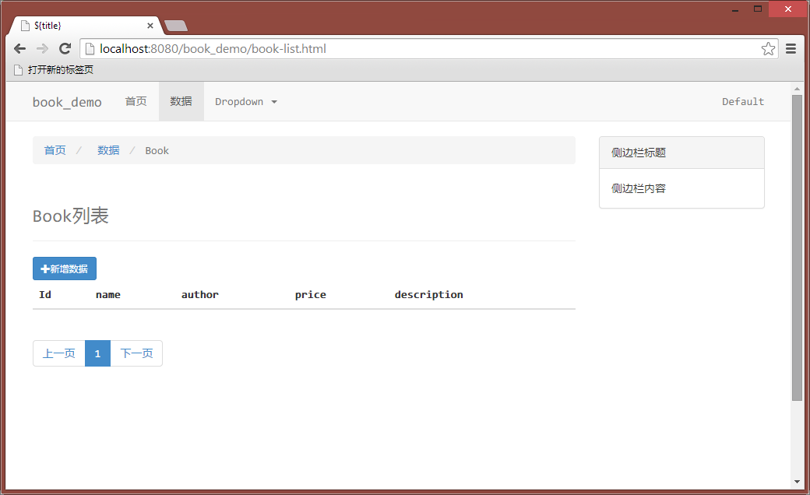
>* 点击新增数据，会出现一个表单，直接点提交，通不过前台校验
>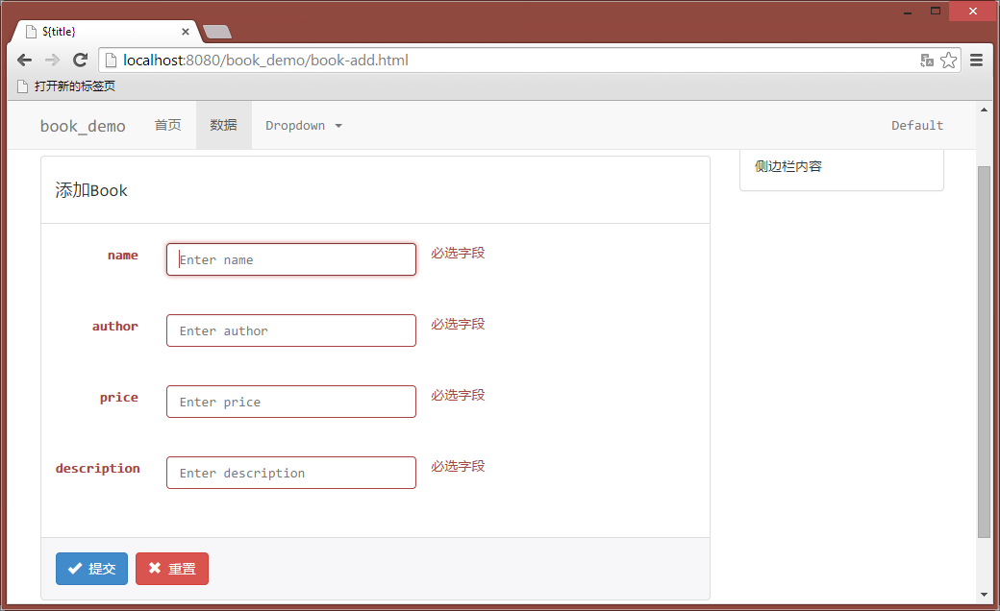
>* 按要求将数据填入表单
>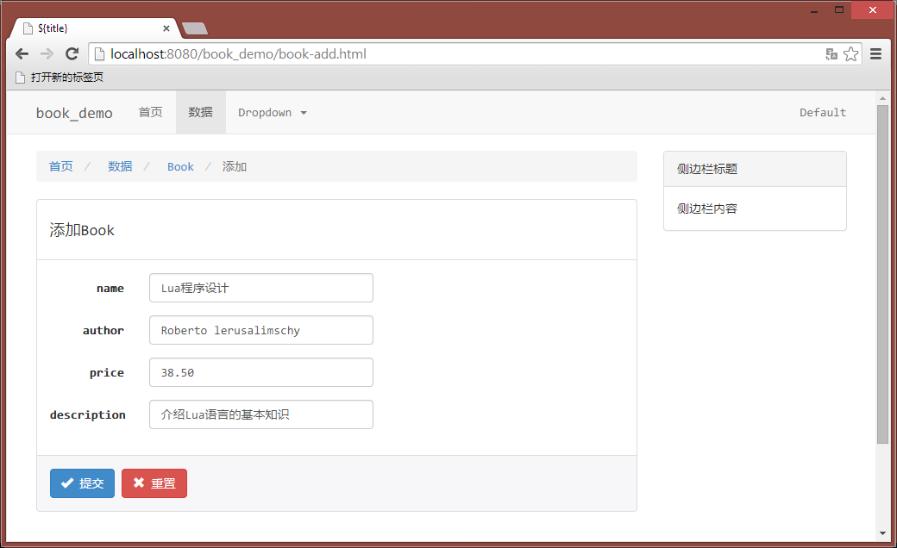
>* 提交，成功了会显示Book列表
>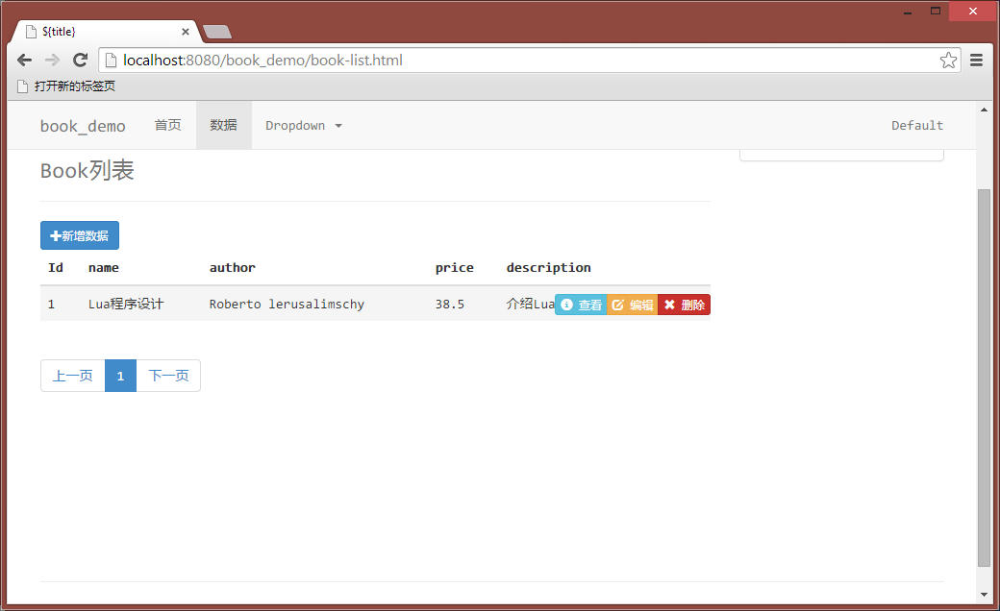
>* 可以进行查看，编辑，删除操作
>* 查看
>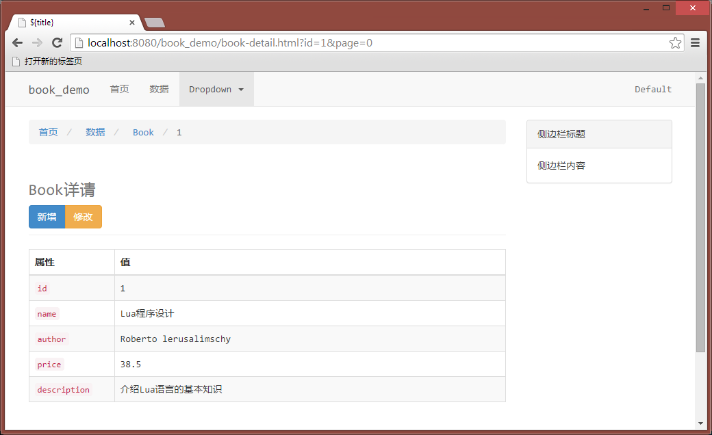
>* 编辑（图略，和添加差不多）
>* 删除
>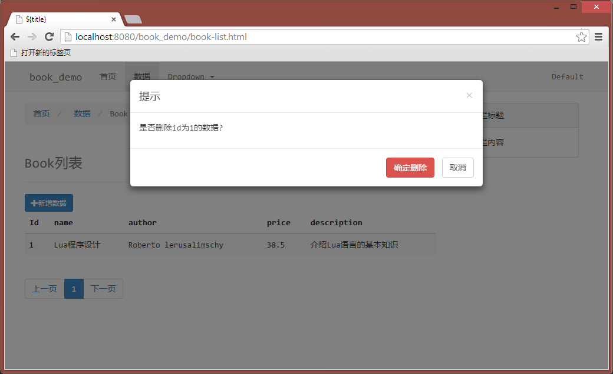

##起源
因为写java代码都写烦了，大部分都是重复的工作，写这样的程序既浪费了大量时间还不增加经验，这样下去生没时候才能升级啊...
很久以前就写过一些可以快速生成代码的程序片段，比如有生成SQL文件的，生成Hibernate映射文件及MyBatis映射文件的。这些程序在一定程度上加快了应用的开发，但是还远不够，因为还有大部分代码也可以按照一定的规则生成。

##原理
用到的原理很简单，主要是使用了模板技术还有java的反射技术，将写的代码修改为一个模板，然后把模板与数据合并输出为文件，输出的文件就是生成的代码。

##源码说明
如果需要修改源代码,除了pom.xml里面的依赖，还需要我写的一个小框架 
[app-framework](https://github.com/fishlab/app-framework)


##框架说明
目前为java web项目使用如下框架

* Spring(context,tx,aop,orm等)实现应用程序资源管理
* Hibernate实现数据访问层
* SpringMVC实现控制层
* Bootstrap3 前台页面

##功能
目前内置的生成器可以生成的代码如下：

* web配置文件(web.xml)
* 项目总体框架
* Spring配置文件以及SpringMVC配置文件
* maven项目模型文件(POM.xml),包含项目依赖的构件
* Hibernate映射文件，Hibernate-Spring配置文件
* 数据访问层(Mapper)接口以及使用Hibernate的实现
* 业务逻辑层(Serivce)接口以及实现
* 控制层(Controller)实现
* 前台页面（包括增删改查）
* 简单的前台校验代码（javascript）
* 测试用例（TestCase）

##下一步工作
* 稍微调程序结构
* 增加jsr303，后台注解校验
* 增加shiro，通用权限验证框架

